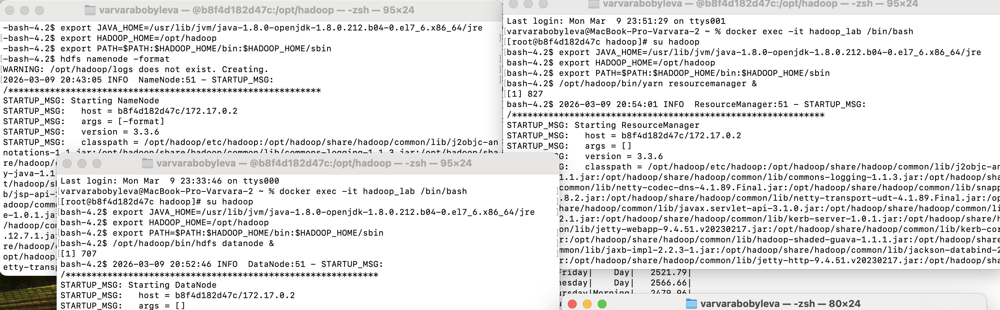
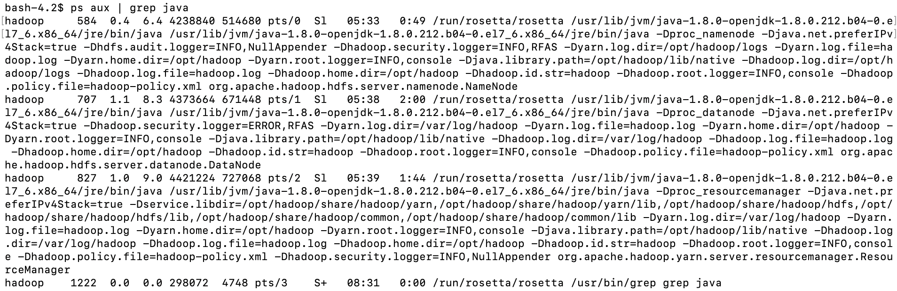
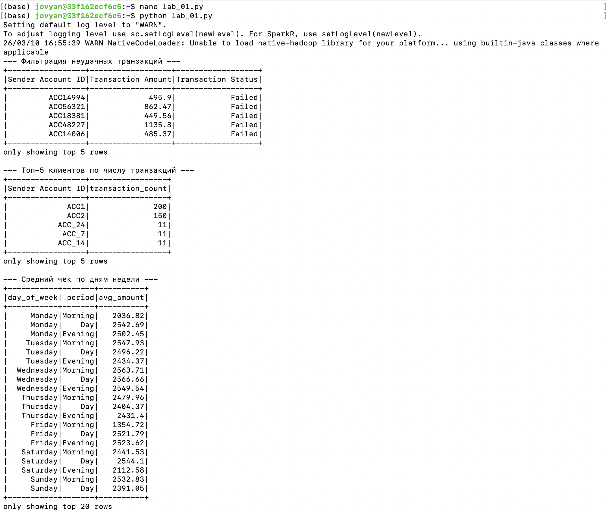
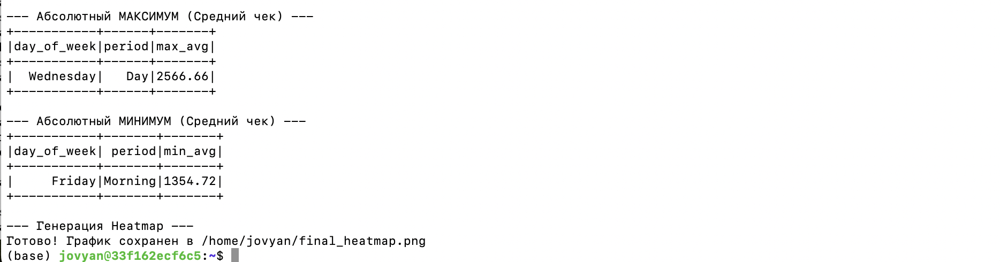
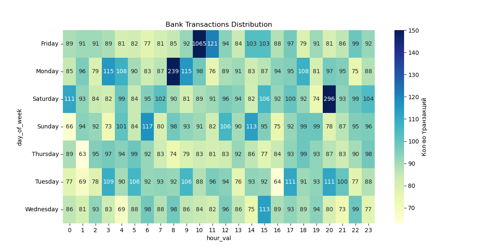

# Отчет по лабораторной работе №1
**Тема:** Анализ банковских транзакций в экосистеме Hadoop/Spark.

## Введение
**Цель работы:** Освоить инструменты Hadoop для хранения данных и PySpark для их аналитической обработки.
**Постановка бизнес-задачи:** Банку необходимо понимать пиковые часы нагрузки для оптимизации работы серверов и выявления аномальной активности.
**Описание данных:** Датасет содержит информацию о транзакциях: `Transaction ID`, `Amount`, `Timestamp`, `Status` (Success/Failed) и гео-данные.

## Ход работы

### 1. Загрузка данных в HDFS
Для имитации распределенного хранилища данные были загружены в HDFS.
> **Скриншот команд:**
`Запуск кластера`

`hdfs dfs -put` и `hdfs dfs -ls`

>

### 2. Предварительная обработка (Data Profiling)
Перед началом анализа была проверена структура данных и наличие пустых значений. Использование `inferSchema` позволило Spark автоматически определить типы данных.

```python
# Проверка типов колонок и структуры
df.printSchema()

# Проверка на наличие пустых значений (NULL)
from pyspark.sql.functions import col, count, when
df.select([count(when(col(c).isNull(), c)).alias(c) for c in df.columns]).show()
```

**Результат:** Типы данных определены корректно. Пропуски в критически важных полях (Transaction Amount, Timestamp) отсутствуют, данные готовы к анализу.

### 3. SQL-аналитика (Бизнес-задачи)

#### Задание 1 HDFS + Spark Core: 
**1. Фильтрация**
С помощью Spark Core был сформирован список транзакций со статусом `Failed`. Это позволяет банку выявлять проблемные узлы и своевременно реагировать на технические сбои у клиентов.

| Sender Account ID | Transaction Amount | Transaction Status |
| :--- | :--- | :--- |
| ACC_10003 |	980.9	| Failed |
| ACC_10007 |	770.0	| Failed |
| ACC_4	| 300.0	| Failed |

**2. Поиск клиентов с наибольшим кол-во транзакций**
  - Выполнена группировка по полю `Sender Account ID`.
  - Использована функция агрегации `count()`.
  - **Результат**: Определены 5 наиболее активных аккаунтов.

| Sender Account ID | Transaction_count |
| :--- | :--- |
| ACC1 | 200 |
| ACC2 | 150 |
| ACC_24 | 11 |
| ACC_7 | 11 |
| ACC_14 | 11 |

#### Задание 2 Spark SQL: 
С помощью Spark SQL:
  - Создано временное представление `transactions`.
  - Рассчитан `AVG(amount)` для периодов:
     - **Morning**: с 06:00 до 12:00.
     - **Day**: с 12:00 до 18:00.
     - **Evening**: после 18:00.
Запрос рассчитывает среднюю сумму операции для каждого сегмента.

```sql
SELECT 
    day_of_week, 
    period, 
    round(avg(`Transaction Amount`), 2) as avg_amount 
FROM transactions 
GROUP BY day_of_week, period 
ORDER BY avg_amount DESC
```

**Итоговые показатели (Экстремумы)**
На основе проведенного анализа были выявлены периоды с самыми высокими и низкими показателями среднего чека:

| Показатель | День недели | Период | Значение (avg_amount) |
| :--- | :--- | :--- | :--- |
| **Максимальный чек** | **Wednesday** | **Day** | **2566.66** |
| **Минимальный чек** | **Friday** | **Morning** | **1354.72** |

#### Аналитическая интерпретация:
*   **Максимум (Среда, День)**: В этот период наблюдается самая высокая покупательская способность. Для бизнеса это «золотое время» для проведения премиальных предложений или крупных транзакций.
*   **Минимум (Пятница, Утро)**: Несмотря на аномально высокое количество транзакций (согласно Heatmap), их средняя сумма — минимальна. Это подтверждает гипотезу о массовых, но мелких регулярных платежах (например, оплата подписок или мелкий ритейл) в конце рабочей недели.
*   **Стабильность:** В выходные (Saturday/Sunday) средний чек остается стабильно высоким (выше 2100), что говорит о высокой покупательской активности клиентов в свободное время.

> **Скриншоты результата выполнения скрипта:**


> 

#### Задание 3 Визуализация: 
Для наглядного представления нагрузки на банковскую систему была построена тепловая карта: **День недели vs Час суток**.


**Интерпретация графика:**
* **Пиковая нагрузка (Hotspots):** На графике зафиксирован аномальный всплеск активности в пятницу в 10:00 (более 1000 транзакций).
*   Бизнес-решение: Необходимо обеспечить максимальную пропускную способность шлюзов в это время.
* **Вечерняя активность:** Наблюдается стабильный поток транзакций в вечерние часы будних дней (18:00–21:00).
*   Бизнес-решение: Оптимальное время для маркетинговых пуш-уведомлений о продуктах банка.
* **Технологическое окно:** Период с 01:00 до 05:00 характеризуется минимальной активностью.
*   Бизнес-решение: Данный интервал выбран как приоритетный для проведения плановых технических работ и обновлений.

## Выводы

В ходе выполнения лабораторной работы были сделаны следующие выводы о применимости стека технологий Hadoop/Spark для анализа банковских данных:
1. **Производительность**: Использование **PySpark** позволило обрабатывать данные в оперативной памяти (In-Memory), что в десятки раз быстрее классических дисковых СУБД при работе с логами транзакций.
2. **Интеграция**: Экосистема **Hadoop** (HDFS) продемонстрировала высокую надежность для хранения сырых данных (`transaction_data.csv`), обеспечивая отказоустойчивость и масштабируемость.
3. **Бизнес-ценность**: 
    * Автоматизация фильтрации неудачных операций позволяет отделу мониторинга мгновенно реагировать на технические сбои.
    * Визуализация нагрузки через тепловые карты (Heatmap) дает четкое понимание «часов пик», что критически важно для планирования мощностей серверов и проведения технических работ.
4. **Масштабируемость**: Выбранная архитектура (Hadoop + Spark) позволяет легко масштабировать данное решение с тестового датасета до терабайтных объемов реальных банковских данных без изменения программного кода.

**Итог**: Стек технологий Hadoop и Spark является оптимальным стандартом для построения современных аналитических систем в финансовом секторе.
