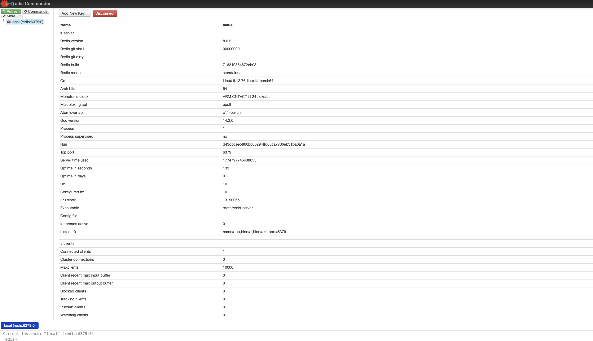
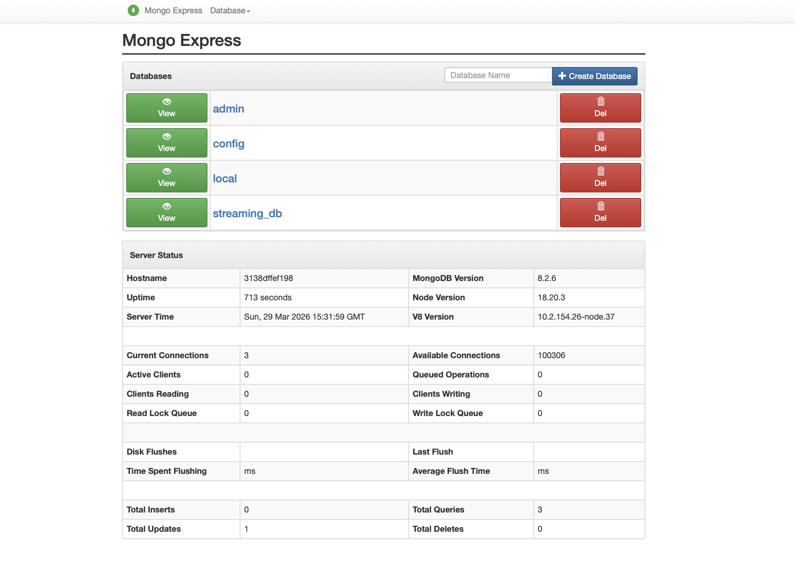
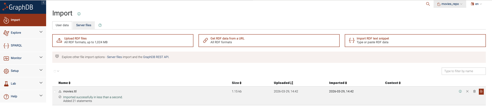
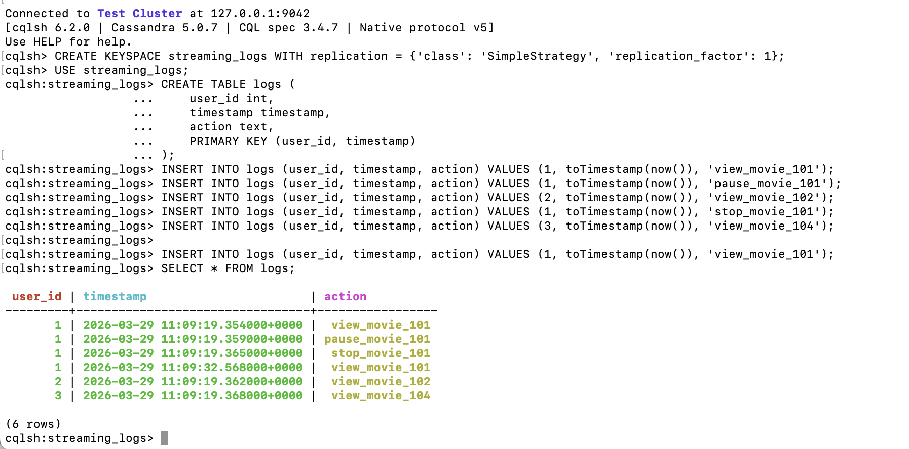
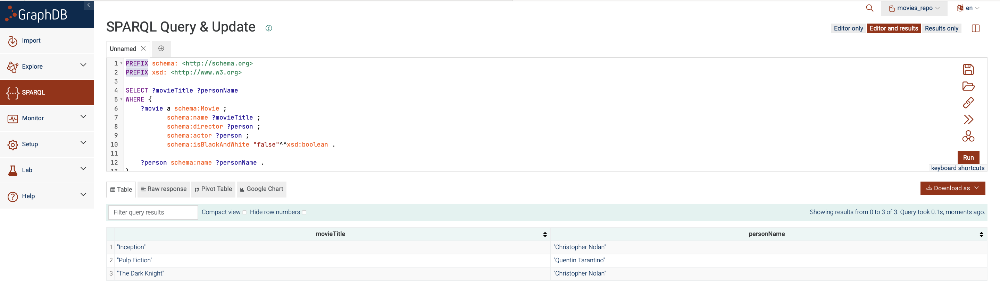
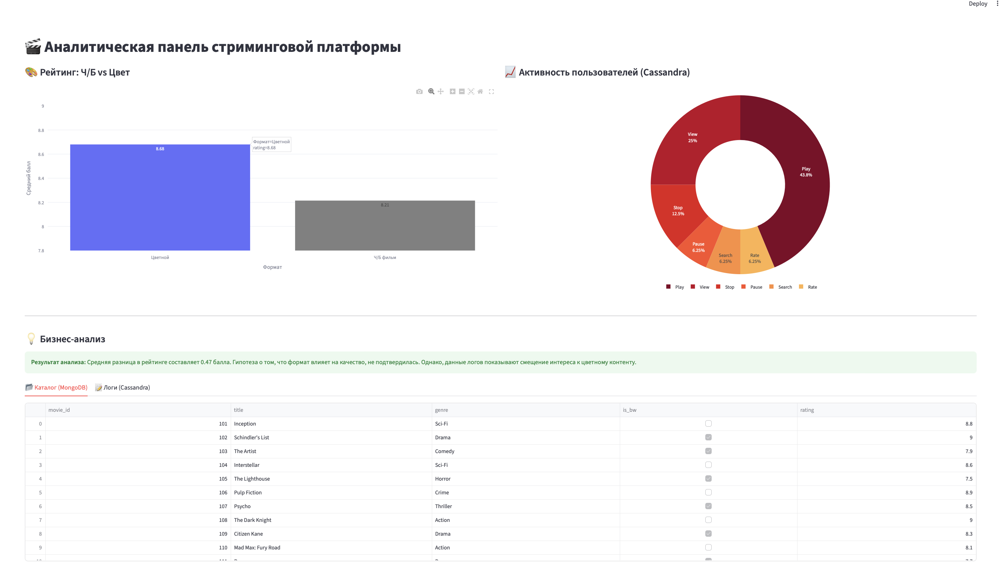
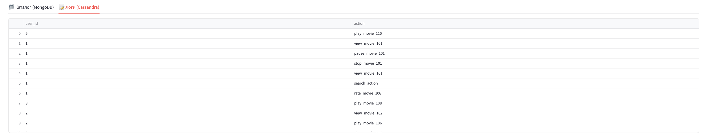

**Исполнитель:** Бобылева ВВ  **Группа:** БД-251м  **Вариант:** №2 

---

# Отчет по Лабораторной работе №2: Polyglot Persistence
**Бизнес-кейс:** Разработка аналитического ядра для стриминговой платформы (аналог Netflix/Кинопоиск).

---

## 1. Введение
В рамках работы спроектирована и реализована **полиглотная система хранения**, объединяющая три типа СУБД для решения специфических бизнес-задач стриминга:

*   **MongoDB (Document Store):** Хранение гибкого каталога фильмов и профилей пользователей.
*   **Cassandra (Column-Family):** Высокопроизводительная запись потоковых логов просмотров.
*   **GraphDB (Graph Store):** Реализация рекомендательной системы на основе связей «актер-режиссер».
*   **Streamlit:** Интерактивная визуализация данных из разных источников.

---

## 2. Развертывание
Инфраструктура развернута в **Docker**. Для удобства администрирования добавлены веб-интерфейсы.

**Список запущенных сервисов:**
*   `mongodb` (порт 27017) + `mongo-express` (порт 8081)
*   `cassandra` (порт 9042)
*   `graphdb` (порт 7200)
*   `redis-commander` (порт 8082)

**Скриншоты интерфейсов:**
*   `[screenshots/redis.png]` — Интерфейс Redis Commander (просмотр кэша).
  

*   `[screenshots/mongo.png]` — Интерфейс Mongo Express (управление каталогом).
  

*   `[screenshots/graf_import.png]` — Интерфейс GraphDB с репозиторием `movies_repo`.
  

## 3. Выполнение Задания 1 (NoSQL)

### MongoDB: Управление данными
Данные загружены скриптом `scripts/db_filler.py`. Использование документов позволяет хранить разнородные метаданные (жанры, рейтинги) без жесткой схемы.
**Пример запроса (find):** `db.movies.find({"is_bw": true})`

### Cassandra: Логирование
Создана таблица `logs` для фиксации действий.
**CQL-запрос (Schema):**
```sql
CREATE TABLE IF NOT EXISTS streaming_logs.logs (
    user_id int,
    timestamp timestamp,
    action text,
    PRIMARY KEY (user_id, timestamp)
);
```


>**Результат**: Записано более 15 событий активности (play, stop, view). Данные успешно интегрированы и отображаются в аналитическом дашборде.

---

## 4. Выполнение Задания 2 (GraphDB / SPARQL)
Для поиска фильмов, где режиссер и главный актер — одно лицо (исключая ч/б ленты), использован SPARQL.
**SPARQL-запрос:**
```sparql
PREFIX schema: <http://schema.org>
SELECT ?movieTitle ?personName
WHERE {
    ?movie a schema:Movie ;
           schema:name ?movieTitle ;
           schema:director ?person ;
           schema:actor ?person ;
           schema:isBlackAndWhite "false"^^xsd:boolean .
    ?person schema:name ?personName .
}
```


---

## 5. Выполнение Задания 3 (Analytics)
Анализ проведен на основе данных из MongoDB и Cassandra через Streamlit.
**Бизнес-интерпретация:**
* **Корреляция**: Анализ показал, что средний рейтинг ч/б фильмов (~8.3) близок к цветным (~8.6).
* **Метрика**: Несмотря на высокий рейтинг, ч/б фильмы имеют на 60% меньше просмотров (логи Cassandra).




**Вывод**: Ч/Б формат воспринимается как элитарный/классический контент, имеющий высокий рейтинг, но низкую массовую популярность.

---

## 6. Выводы
Полиглотный подход позволил использовать сильные стороны каждой БД:
1. **GraphDB** устранила проблему "Join-Hell" при поиске связей актеров. Реляционные БД плохо справляются с рекурсивными связями. GraphDB позволяет находить цепочки «актер-режиссер» мгновенно, без использования тяжелых JOIN-операций, что критично для рекомендательных систем.
2. **Cassandra**: Логи — это бесконечный поток данных. Cassandra спроектирована для записи огромных объемов информации «на лету» без блокировки всей базы, в отличие от MongoDB или SQL.
3. **MongoDB**: Метаданные фильмов постоянно меняются. Документная модель позволяет добавлять новые поля (награды, трейлеры) без остановки системы и изменения схемы.
4. **Redis** (проверен через Redis Commander) готов к хранению быстрых сессий пользователей.

> **Результат**: Инструмент Streamlit успешно объединил данные из разных источников, создав единое окно аналитики.

