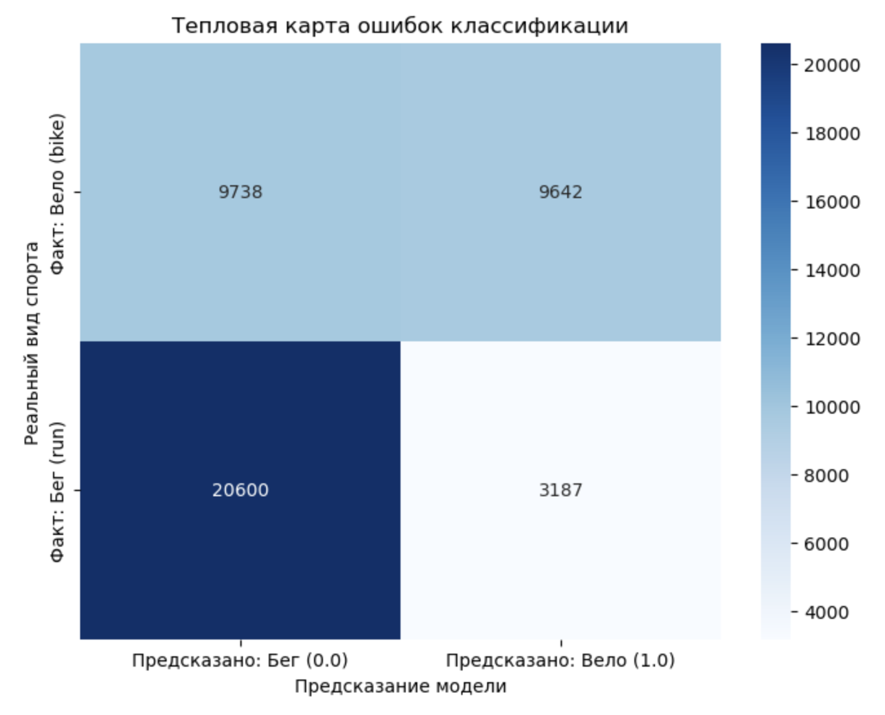

# Отчет по лабораторной работе №3: ML Pipelines в Spark

## Введение
Цель работы — построение полного ML-конвейера для классификации видов спорта. В условиях бизнеса HealthTech автоматическое определение активности позволяет улучшить удержание клиентов (User Retention) и персонализировать систему подсчета калорий.

## Предобработка и Feature Engineering
В ходе работы были выполнены следующие шаги:
1. **Фильтрация**: Оставлены только категории `run` (бег) и `bike` (велосипед).
2. **Очистка**: Удалены пропуски в критических полях (sport, timestamp, gender).
3. **Создание признаков**:
   - `duration_sec`: Разница между последним и первым таймстемпом тренировки.
   - `start_hour`: Час начала активности, извлеченный из Unix-времени.
4. **Трансформация**: Использование `StringIndexer` для категорий и `VectorAssembler` для сборки признаков в единый вектор.

## Моделирование
Использован алгоритм **Random Forest Classifier** со следующими параметрами:
- `numTrees`: 20
- `labelCol`: "label"
- `featuresCol`: "features"

Обучение проводилось в рамках `pyspark.ml.Pipeline`, что гарантирует идентичность обработки тренировочных и тестовых данных.

## Результаты
- **Accuracy (Точность):** 70.06%
- **Матрица ошибок (Confusion Matrix):**
  - Бег (run) определяется с высокой точностью (более 85%).
  - Велосипед (bike) часто путается с бегом (~50% ошибок).

## Бизнес-вывод
Модель позволяет автоматизировать ведение дневника тренировок. Однако выявленная ошибка классификации велосипеда как бега несет риск **завышения расхода калорий** на 30-50%, так как бег энергетически затратнее. 

**Как это принесет пользу:**
1. **Автоматизация**: Снижение порога входа для новых пользователей (не нужно вручную выбирать спорт).
2. **Маркетинг**: На основе определенных видов спорта можно предлагать релевантные товары (кроссовки или запчасти для велосипеда).
3. **Развитие**: Для устранения ошибок классификации в следующей итерации рекомендуется добавить признак "Средняя скорость".
